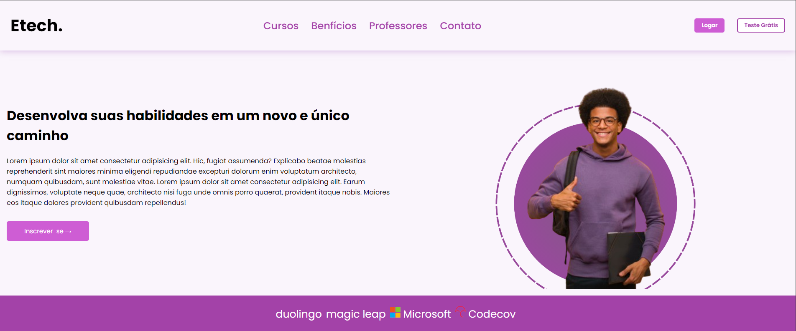

<h1 align="center"> #Etech </h1>

Projeto exclusivo e gratuito, promovido por Pedro Santos para teste de habilidades em tecnologias WEB.

  <a href="#-tecnologias">Tecnologias</a>&nbsp;&nbsp;&nbsp;|&nbsp;&nbsp;&nbsp;
  <a href="#-projeto">Projeto</a>&nbsp;&nbsp;&nbsp;|&nbsp;&nbsp;&nbsp;
  <a href="#-layout">Layout</a>&nbsp;&nbsp;&nbsp;|&nbsp;&nbsp;&nbsp;
  <a href="#memo-licença">Licença</a>

  

 

  

## 🚀 Tecnologias

Esse projeto foi desenvolvido com as seguintes tecnologias:

- HTML e CSS
- Git e Github

## 💻 Projeto

O projeto Etech é um site que contêm descrições de cursos que são ensinados na escola virtual

## 🔖 Link

Você pode visualizar o layout do projeto através [DESSE LINK](https://pedroh3nrique.github.io/etech/).

## :memo: Licença

Esse projeto está sob a licença MIT.

---

Feito com ♥ by Pedro Santos :wave:
